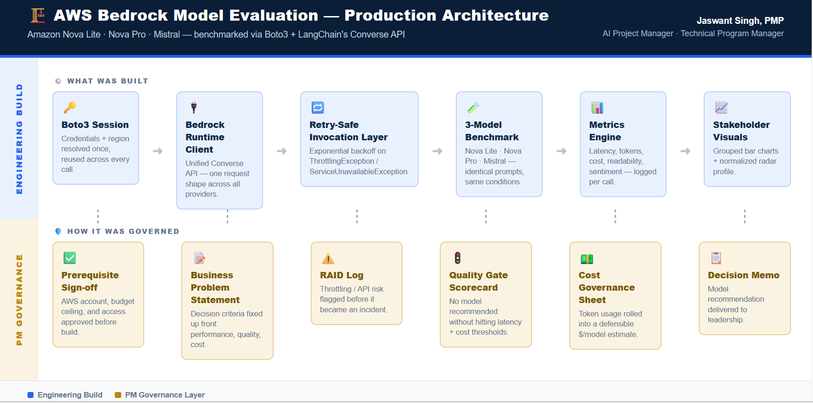

# AWS Bedrock Model Evaluation | Production Grade Benchmark Pipeline

**Role:** AI Project Manager / Technical Program Manager
**Stack:** Amazon Bedrock · Boto3 · LangChain (Converse API) · SageMaker Studio · Python

---

## 🎯 Business Problem

X Company needs a defensible, data-driven way to select a foundation model on Amazon Bedrock for conversational AI and text-processing workloads — without a structured method, model choice can't be justified to engineering or business stakeholders.

This project builds a repeatable benchmark pipeline to compare **Amazon Nova Lite**, **Amazon Nova Pro**, and **Mistral** across performance, quality, and cost, producing evidence a team can act on immediately.

## 🏗️ Architecture



The pipeline runs two tracks in parallel: an **engineering build** (connection → retry-safe invocation → benchmark → metrics) and a **PM governance layer** (problem statement → RAID log → quality gate → cost governance → decision memo) that turns raw output into a stakeholder-ready recommendation.

## ⚙️ What's in this repo

| File | Purpose |
|---|---|
| `Lab_AWS_Bedrock_Model_Comparison.ipynb` | Benchmark harness: connects to Bedrock, runs retry-safe invocations, scores models across 6 dimensions |
| `requirements.txt` | Python dependencies |
| `outputs/metrics_table.csv` | Per-model latency, tokens, readability, sentiment, estimated cost |
| `outputs/charts/` | Comparison visuals (grouped bar charts, normalized radar profile) |
| `docs/decision_memo.md` | Model recommendation written for a non-technical stakeholder audience |
| `docs/raid_log.md` | Risks identified during the build (throttling, cost variance) and mitigations |
| `docs/quality_gate_scorecard.md` | Latency + cost thresholds a model must clear before being recommended |

## 📊 Evaluation Dimensions

- **Latency** — execution time per prompt, per model
- **Token usage** — input/output tokens, mapped to current Bedrock pricing
- **Response quality** — readability (Flesch reading ease), sentiment polarity, response similarity
- **Reliability** — retry-safe invocation with exponential backoff on `ThrottlingException` / `ServiceUnavailableException`
- **Cost** — estimated $/model, rolled up from actual token usage across the benchmark suite

## 🔑 Key Result

Nova Lite matched Nova Pro's output volume closely (933 vs. 1,071 words across the same 3 prompts) while running ~13% faster on average and costing ~15x less per benchmark run ($0.000323 vs. $0.004934). Recommended Nova Lite as the default model in the decision memo, with Nova Pro reserved for use cases where the marginal content gain is worth the cost premium — a tradeoff surfaced for stakeholder sign-off rather than assumed.

## 🛠️ How to Run

```bash
git clone https://github.com/JaswantOnGit/aws-bedrock-model-evaluation.git
cd aws-bedrock-model-evaluation
pip install -r requirements.txt
# Add your AWS credentials via .env or aws configure — never commit credentials
jupyter lab
```

## 📎 Credit

Hands-on lab structure based on the K21Academy end-to-end project *"Resolving Business Challenges: Evaluating AWS Bedrock Models to Optimize AI Workflows,"* guided by Atul Kumar. This repo reflects my own build, governance documentation, and analysis on top of that exercise.

---
**Jaswant Singh, PMP** · [LinkedIn](https://linkedin.com/in/jaswantsingh-pmp)
